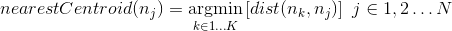
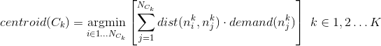
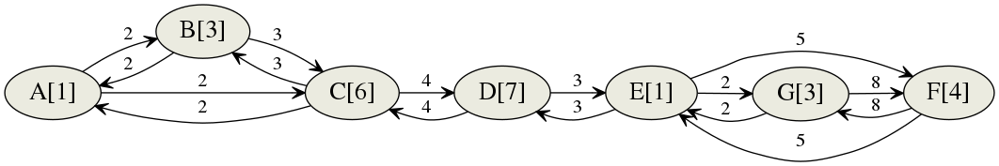
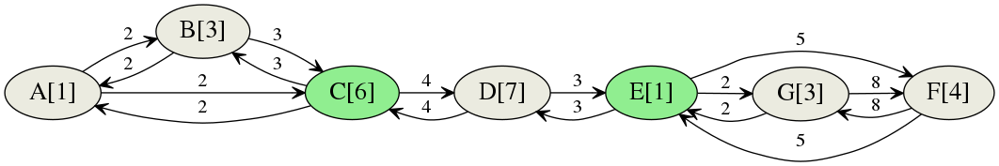

# K-means Clustering on a Weighted Directed Graph with Priorities
## Definition of the problem
Suppose to have a city modeled as a directed graph, every node represents a place in which an accident can occur with a certain probability. The goal is to place a certain number of ambulances in such a way that they offer the best coverage on the city, meaning that they are spread over different areas and close to the nodes with higher priority.

The initial data for the problem are then:
* A map described by its adjacency matrix and a matrix of the shortest paths between all the nodes
* The priority of each node
* K as the number of available ambulances, we are going to fragment the graph in K clusters and for every one of them find the node whose position is optimal

## K-means Clustering
### Initialization step
Randomly choose K nodes to be the initial centroids for the graph.

### Iterative steps
1. Associate every node to the centroid whose travel distance to the node is minimum, thus creating K clusters of nodes. The metric chosen to associate a node to a centroid can be understood by thinking that every node wants to belong with the centroid that can reach that node in the fastest way

(here nk represents the k-th centroid)
2. Now that we have clusters of nodes we have to pick the best node to be the centroid of every cluster. The optimal node is the one that can reach all the other nodes with the lowest travel cost. In order to respect the priorities we consider for every node the sum of the travel distances to every other node in the cluster multiplied by their demands.

(NCk is the number of nodes in the k-th cluster and nki is the i-th node of the k-th cluster )

### Convergence
After a number of iterations the centroids will not change anymore and the algorithm will have converged.

## Example and Matrix Interpretation
### Adjacency Matrix, Priorities and Shortest Paths
Adjacency matrix:

| - | A | B | C | D | E | F | G |
|---|---|---|---|---|---|---|---|
| A | 0 | 2 | 2 | - | - | - | - |
| B | - | 0 | 3 | - | - | - | - |
| C | - | 3 | 0 | 4 | - | - | - |
| D | - | - | 4 | 0 | 3 | - | - |
| E | - | - | - | 3 | 0 | 5 | 2 |
| F | - | - | - | - | 5 | 0 | 8 |
| G | - | - | - | - | 2 | 8 | 0 |

Shortest paths lengths:

|   | A  | B  | C  | D | E  | F  | G  |
|---|----|----|----|---|----|----|----|
| A | 0  | 2  | 2  | 6 | 9  | 14 | 11 |
| B | 2  | 0  | 3  | 7 | 10 | 15 | 12 |
| C | 2  | 3  | 0  | 4 | 7  | 12 | 9  |
| D | 6  | 7  | 4  | 0 | 3  | 8  | 5  |
| E | 9  | 10 | 7  | 3 | 0  | 5  | 2  |
| F | 14 | 15 | 12 | 8 | 5  | 0  | 7  |
| G | 11 | 12 | 9  | 5 | 2  | 7  | 0  |

Node priorities:

| A | B | C | D | E | F | G |
|---|---|---|---|---|---|---|
| 1 | 3 | 6 | 7 | 1 | 4 | 3 |

Shortest paths lengths row-wise multiplied by the node priorities:

|   | A  | B  | C  | D  | E  | F  | G  |
|---|----|----|----|----|----|----|----|
| A | 0  | 6  | 12 | 42 | 9  | 56 | 33 |
| B | 2  | 0  | 18 | 49 | 10 | 60 | 36 |
| C | 2  | 9  | 0  | 28 | 7  | 48 | 27 |
| D | 6  | 21 | 24 | 0  | 3  | 32 | 15 |
| E | 9  | 30 | 42 | 21 | 0  | 20 | 6  |
| F | 14 | 45 | 72 | 56 | 5  | 0  | 21 |
| G | 11 | 36 | 54 | 35 | 2  | 28 | 0  |

Graph:

For a total of 7 nodes we want to find 2 centroids. Let us choose the nodes __A__ and __C__ as initial centroids.
To cluster the nodes we need to select the nearest centroid to that node, this can be done considering the rows corresponding to the centroids in the shortest paths matrix and for every column select the lowest number.

|   | A     | B     | C     | D     | E     | F      | G     |
|---|-------|-------|-------|-------|-------|--------|-------|
| A | __0__ | __2__ | 2     | 6     | 9     | 14     | 11    |
| C | 2     | 3     | __0__ | __4__ | __7__ | __12__ | __9__ |

Now, for every cluster we need to select the best node to be the new centroid. In order to do so consider the shortest paths matrix weighted by the priorities and limited to the rows/columns of the first cluster: A, B.
Summing over the rows and taking the lowest sum yields the optimal centroid.

|   | A  | B  |   Sum   |
|---|----|----|---------|
| A | 0  | 6  |    6    |
| B | 2  | 0  |  __2__  |

Node B then results the optimal centroid for the cluster {A, B}

On the second cluster, containing the nodes C, D, E, F, G, we do the same operation, finding D as the best centroid.

|   | C  | D  | E | F  | G  | Sum    |
|---|----|----|---|----|----|--------|
| C | 0  | 28 | 7 | 48 | 27 | 110    |
| D | 24 | 0  | 3 | 32 | 15 | __74__ |
| E | 42 | 21 | 0 | 20 | 6  | 89     |
| F | 72 | 56 | 5 | 0  | 21 | 158    |
| G | 54 | 35 | 2 | 28 | 0  | 119    |

In the next step, using B and D as initial centroids we will find:

| Cluster    | Centroid |
|------------|----------|
| A, B, C    | __C__    |
| D, E, F, G | __E__    |

Another iteration will yield the same clustering and the same centroids, indicating that the process has converged to the following solution:

## Implementation notes
The algorithm is not perfect and sometimes can get stuck in a suboptimal situation. In the previous example, choosing the node F as initial centroid will always yield:

| Cluster          | Centroid |
|------------------|----------|
| A, B, C, D, E, G | __D__    |
| F                | __F__    |

This is due to the fact that no node will be clustered together with F and for this reason F will always be in a cluster on his own and won't move.

To solve this issue a voting system has been implemented. The system is trivial to understand: the algorithm is run several times and each time the K nodes selected as centroids earn +1 vote, in the end the K nodes with more votes are selected to be the final centroids.
